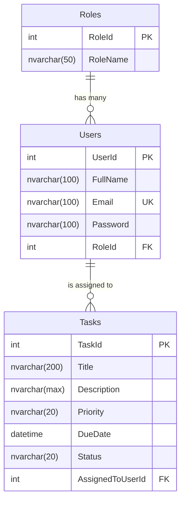

# Task Manager - Database Schema

## 📊 Entity Relationship Diagram (ERD)

## 🏗️ Table Definitions

### 1. Roles Table
Storage for application roles.
- `RoleId`: (INT, Identity) Unique ID.
- `RoleName`: (NVARCHAR 50) Role type (Admin, Manager, Employee).

### 2. Users Table
Application user data.
- `UserId`: (INT, Identity) Unique ID.
- `FullName`: (NVARCHAR 100) Full user name.
- `Email`: (NVARCHAR 100, Unique) Login email.
- `Password`: (NVARCHAR 100, Hashed) User password.
- `RoleId`: (INT, FK) Reference to Roles.

### 3. Tasks Table
Task entity storage.
- `TaskId`: (INT, Identity) Unique ID.
- `Title`: (NVARCHAR 200) Task summary.
- `Description`: (NVARCHAR MAX) Detailed task info.
- `Priority`: (NVARCHAR 20) High, Medium, Low.
- `DueDate`: (DATETIME) Task deadline.
- `Status`: (NVARCHAR 20) Pending, In-Progress, Completed.
- `AssignedToUserId`: (INT, FK) User responsible for task.

## ⚙️ Stored Procedures

### `sp_CreateTask`
Quickly inserts a new task and returns its ID.

### `sp_UpdateTaskStatus`
Updates only the status field of a given task.

### `sp_DeleteTask`
Performs a hard-delete of a task record.

### `sp_GetAllTasksAdmin`
Complex join query that returns task data plus assigned user's full name.
